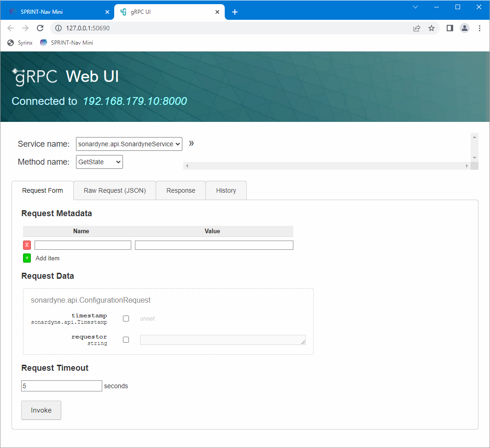
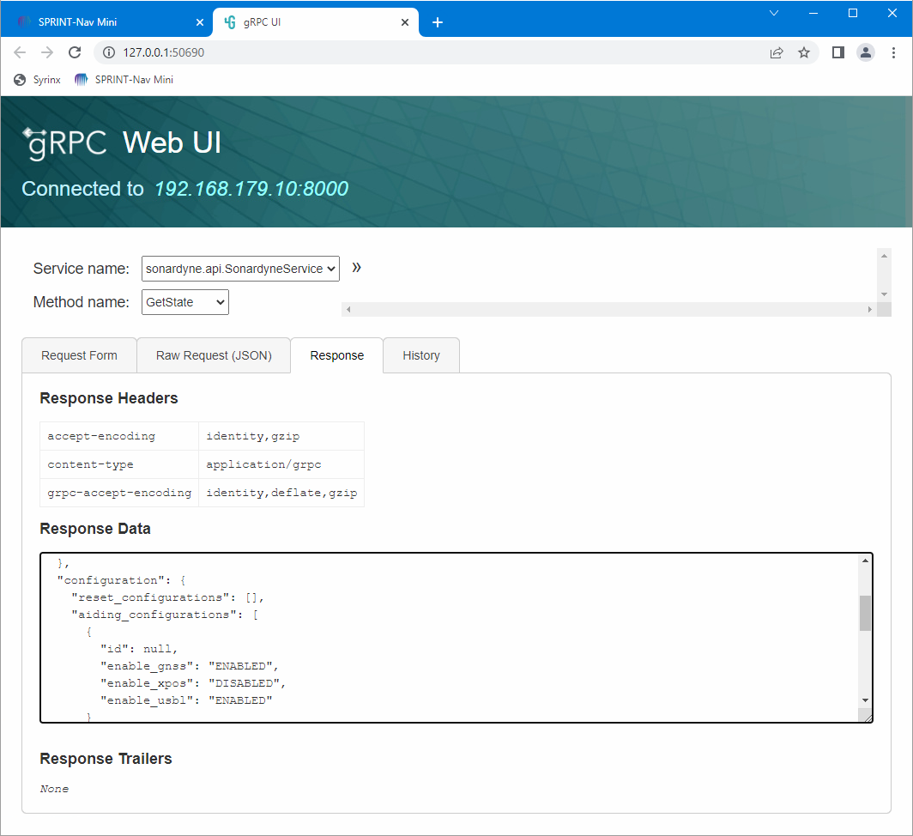
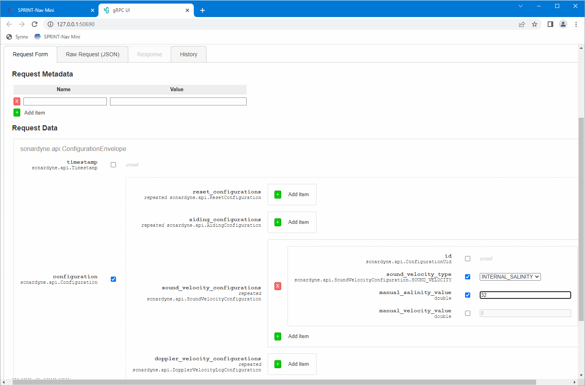
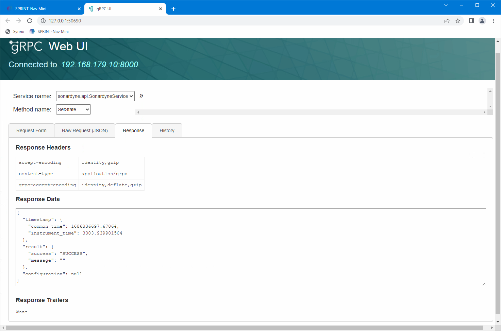

# External References

The below references are useful for development, but are in no way affiliated with Sonardyne.

## Awesome gRPC
[awesome-grpc](https://github.com/grpc-ecosystem/awesome-grpc) is a list of resources for gRPC development.

## gRPC UI

[gRPC UI](https://github.com/fullstorydev/grpcui/) is a command-line tool that lets you interact with gRPC servers via a browser. The resulting UI allows the user to interactively construct requests to send to a gRPC server, by presenting all of the fields in a tree view. [It uses the MIT License](https://github.com/fullstorydev/grpcui/blob/master/LICENSE).

??? son-info "Example use of gRPC UI"
    *To perform a GetState, select "GetState" from the "Method name" dropdown and click "Invoke" (leaving the other fields blank).*  
    {: style='height: 600px'}  
    *Response from the GetState:*  
    {: style='height: 600px'}  
    *To perform a SetState, select "SetState" from the "Method name" dropdown and add the necessary fields using the tree view below.*  
    {: style='height: 600px'}  
    *Response from the SetState:*  
    {: style='height: 600px'}  

To install gRPC UI, go to the [gRPC UI GitHub releases page](https://github.com/fullstorydev/grpcui/releases) and download the latest release (e.g. grpcui_1.3.1_windows_x86_64.zip). Extract the zip to a location from which you can run the executable (e.g. C:/tools/grpcui/). Open a command/terminal window in the same directory as grpcui.exe, and run the following command:  
`grpcui.exe -plaintext -import-path ./protos -proto service.proto 192.168.179.10:8000`  
Note that in this example, the `.proto` files are located in a `protos` folder at the same level as `grpcui.exe`
