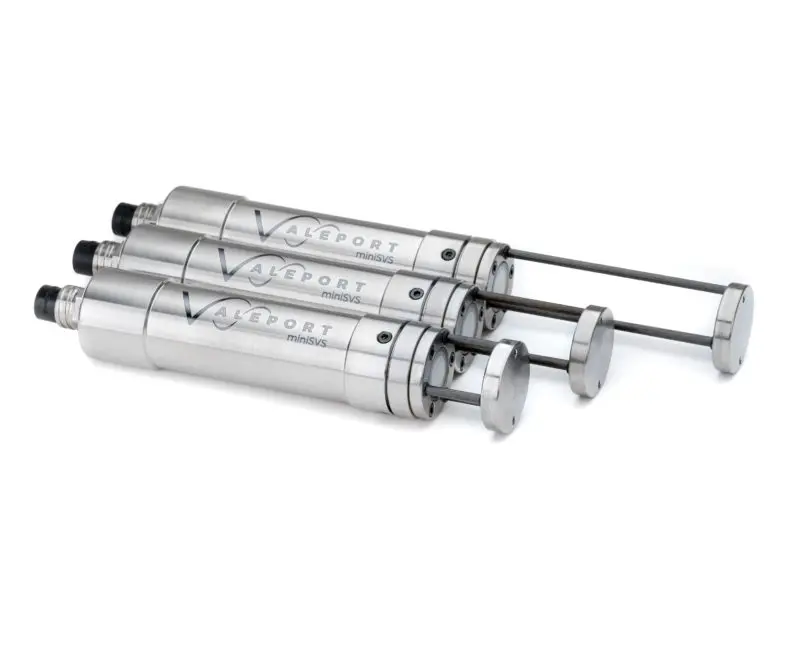
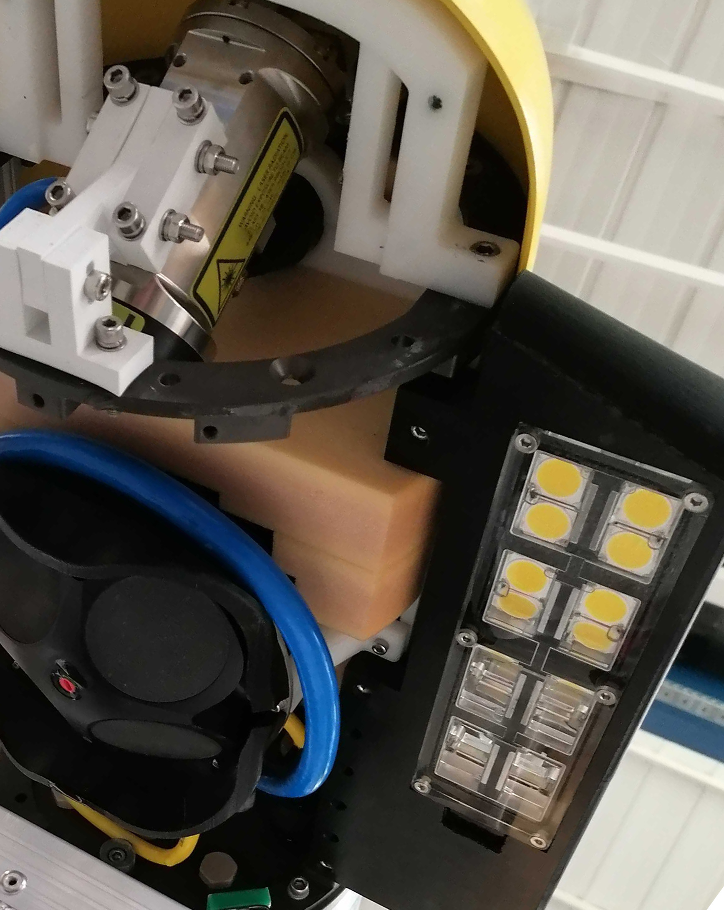
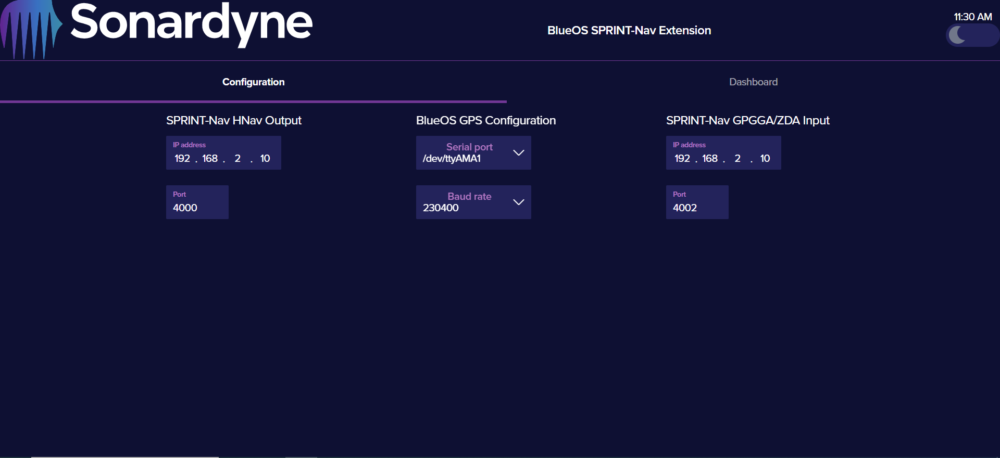

## Sprint-Nav Mini

SPRINT-Nav Mini is designed to be easily integrated into multiple classes of vehicle/vessel. All available inputs and outputs, as well as detailed integration documents, are described in the product manual and the manual should be considered the reference for the use of these systems. This section provides a broad overview of how the API alongside other messages can be used with a SPRINT-Nav mini.

#### Physical installation

SPRINT-Nav Mini can be installed at any convenient location where the DVL has an unobstructed view of the seabed. However, to gain optimal performance there are some guidelines. 

CAD (Computer Aided Design) .stp files are available on Sonardyne's [knowledge base](https://www.sonardyne.com/products-knowledge-base/sprint-nav-mini-stp-files/)

??? son-info "Installation Guidelines"
    - The location must not be subject to excessive vibration or impulse shock.  
    - The location must not exceed the environmental limits for the temperature.  
    - The location must provide a mounting surface that is of sufficient strength to support the weight of the SPRINT-Nav Mini safely and without flexing.  
    - The location must provide access for power and communication connections.  
    - The location must provide line of sight to the seabed for all four DVL transducers abiding by the clearance levels. 

 
#### Time

The SPRINT-Nav Mini can be time synchronised to UTC. This can be achieved via NTP or by providing a 1PPS signal and ZDA NMEA-0183 message from a GNSS receiver or similar clock source. 

If the serial communication link has a known, stable latency then it is possible to use ZDA only, but 1PPS is recommended where possible. If the SPRINT-Nav Mini has been time synchronised and its quality is less than or equal to 0.5s it is possible to stop providing ZDA messages and simply rely on 1PPS aiding without any loss of accuracy.

To improve robustness and usability, the SPRINT-Nav Mini incorporates a feature that automatically detects the relationship between the ZDA and 1PPS without any configuration. The SPRINT-Nav Mini achieves this by treating ZDA and 1PPS aiding separately: by filtering over several ZDA and 1PPS observations, it alleviates the requirement for a user to configure the ZDA and 1PPS relationship. In addition, the SPRINT-Nav Mini automatically detects the leading edge of the 1PPS trigger (assuming the pulse width is much less than 0.5s). 
If external time synchronisation is lost the INS can continue to maintain an estimate of UTC time using its internal clock (~5ppm drift).

The ZDA message should conform to the NMEA 0183 standard. The message can be received on any channel or over Ethernet. The 1PPS signal should be a 5V DC pulse with >1 µs duration. The signal can be fed to SPRINT-Nav Mini via any of the trigger channels. 

There are three modes available:  

* None 
* ZDA (+1PPS)
* NTP

Time can also be output by a SPRINT-Nav Mini via an output ZDA + 1PPS, typically used for time synchronising other onboard survey sensors. 

#### Sound velocity

Accurate knowledge of Sound Velocity (SV) is crucial for Hybrid (DVL/INS) navigation, as such SPRINT-Nav Mini supports three types of SV. It is recommended to always use external SV for operations requiring high navigation accuracy. 

* Manual
    * Provides an ability to type in a manual SV, to be used when SV is very stable or as a backup. 
* Derived
    * Uses water temperature and a manually entered salinity value to calculate SV.
* External 
    * Uses an external SV sensor to input a direct read sound velocity into the SPRINT-Nav Mini.

{: style="width: 40%;" data-title="Valeport SV Sensors."  }

??? son-info "Notes on SV"
    - Sonardyne find that a 25mm SV sensor provides enough accuracy for navigation and minimises risk of damage to the SV sensor.
    - Place the SV sensor as close to the DVL as possible.
    - Place the SV Sensor within the same body of water as the DVL.
    - Any error in SV will often appear as an along track error if no external aiding source is provided i.e. GNSS or USBL.    

#### DVL mounting

SPRINT-Nav Mini can be mounted at any angle however, typically the DVL is mounted facing directly down on the vehicle providing the best tracking of the seabed. Occasionally on trenchers or other vehicles where a direct view of the seabed is not possible, the DVL may be installed at an angle. 

{: style="width: 40%;" data-title="SPRINT-Nav Mini beams."  }

#### Position aiding

##### USBL
SPRINT-Nav Mini supports USBL aiding via industry-standard telegrams. 

##### GNSS
SPRINT-Nav Mini uses GNSS for aiding of both time and position via industry-standard telegrams.

##### XPOS
SPRINT-Nav Mini supports Sonardyne's proprietary XPOS message for aiding of generic position observations. Typically an XPOS message is provided to a SPRINT-Nav Mini when a vehicle is docked, initialising on deck or any scenario whereby a GNSS or USBL message is not appropriate. 

## AUV x SPRINT-Nav Mini

SPRINT-Nav Mini has been designed for AUV integration and this section will describe an example integration into a 10" diameter AUV, with a common setup with a mix of input, output, C2 (command & control) and peripheral survey sensors. 

??? son-info "Inputs"
    - GNSS
    - USBL
    - Sound Velocity 

??? son-info "Outputs"
    - HNav
    - ZDA + 1PPS

??? son-info "C2"
    - gRPC API

??? son-info "Survey Sensors"
    - Voyis Recon - Laser
    - Voyis Recon - Camera

{: style="height: 50vh;" data-title="Sparus AUV" }

### Mounting location

In this example the SPRINT-Nav Mini is mounted in the free flooded nose cone of a [Sparus](https://ocean.soton.ac.uk/smarty200). The DVL has a clear view of the seabed with no obstructed beams. 

{: style="height: 50vh;" data-title="Sparus AUV mounting location" }

### Aiding sensors
SPRINT-Nav Mini can have multiple aiding sensors enabled at once so it will seamlessly use GNSS on surface and USBL when it becomes available subsea. 

#### GNSS
When on the surface the AUV receives both positioning updates (GGA) and timing (ZDA + 1PPS) from the onboard GNSS which is mounted on a mast at the rear of the vehicle. 

??? son-info "GNSS aiding on an AUV"
    * When configuring a GNSS in SPRINT-Nav Mini, consider that GNSS accuracy estimates are often optimistic. Sonardyne recommend setting a relaxed manual GNSS quality.
    * GNSS often gives erroneous positions as a vehicle surfaces and when a vehicle dives. SPRINT-Nav Mini will reject data that falls outside its own position error estimate, disable GNSS when diving and for a period of time after breaking the surface. 
    * SPRINT-Nav Mini doesn't currently use VTG for velocity aiding, but will in the future. 

#### USBL
When submerged, the AUV utilises Sonardyne's Mini Ranger 2 Robotics Pack to track an [AvTrak 6 Nano](https://www.sonardyne.com/products/avtrak-6-nano-auv-swarm-tracking-and-communications/) mounted in the AUV. This AvTrak 6 Nano is used for communicating with the surface and also for sending position updates into the SPRINT-Nav Mini. 

??? son-info "USBL Aiding a SPRINT-Nav Mini on an AUV"
    * All AvTrak 6 nano's, when being tracked by "Robotics Pack", can output a time-stamped GGA message directly from their serial port in addition to the native SPOS format which can be interfaced directly to the SPRINT-Nav Mini. See the AvTrak 6 Nano manual for more details. 
    * Ranger 2 Robotics Pack can track up to 10 vehicles at once, simultaneously sending them correct absolute position information as well as exchanging telemetry. 

#### Sound velocity
For sound velocity a Valeport 25 mm SVS is used, outputting the Valeport standard telegram into the vehicle control system and then over UDP into the SPRINT-Nav Mini.  

### Outputs

#### HNav
HNav is output at 100 Hz for vehicle guidance purposes. All status flags are decoded and presented in the AUV Web UI so that the operator knows when it is ok for the vehicle to begin operations. 

See [Reference](reference.md) for further details.

??? son-info "HNav Notes"
    * If an output message is populated at a rate quicker than the rate of the incoming sensor the HNav status field will be set to invalid (because the flag indicates invalid or old). For example in a 100 Hz output HNav message, if DVL is coming into the SPRINT-Nav Mini at 10 Hz, in excess of 90% of messages would be expected to have an invalid altitude flag. 
    * HNav can be input directly into EIVA NaviScan in a traditional survey setup. 

#### Timing
Timing is crucial for survey deliverables as all sensors which are logging data must log against a common time base. This is typically UTC. SPRINT-Nav Mini can be configured to both receive time updates and will also persist time when subsea.

In this example a ZDA + 1PPS output is configured from the SPRINT-Nav Mini into all survey sensors on the AUV. 

??? son-info "ZDA + 1PPS output"
    * Outputting a ZDA + 1PPS doesn't mean that time won't drift when the vehicle is subsea, but all sensors will be in the same time base. 
    * SPRINT-Nav Mini constantly models and monitors time, as such when the AUV surfaces and GNSS timing is available once again, SPRINT-Nav Mini's UTC time will adjust to reflect the correct UTC time. 

### C2
Command and Control of a SPRINT-Nav Mini uses the Sonardyne gRPC API to modify settings dynamically during a mission as and when required, either autonomously or via the user-developed AUV interface. 

??? son-info "Suggested SPRINT-Nav Mini C2"
    * Via the user-developed AUV interface the AUV operator can reset the INS algorithm instantaneously if required (soft reset).
    * If the vehicle/operator knows that GNSS is erroneous it can be disabled as an aiding source for a period of time. 
    * If the SPRINT-Nav HNav message flags a problem with the Sound Velocity sensor, the C2 changes the SV configuration to derived and then manual. 
    * The user-developed AUV interface allows a user to select which aiding sources should be used by the AUV pre-dive without using the SPRINT-Nav Mini user interface.
    * The gRPC API is much lower bandwidth than the web UI allowing for over the horizon low bandwidth operations. 
     

### Data 
For high accuracy survey products, [Janus] (https://www.sonardyne.com/products/janus-ins-post-processing-software/) is typically used. In this example logfiles are downloaded at the end of the mission via the web UI. 

??? son-info "Data for long duration AUVs"
    * SPRINT-Nav Mini will log data internally for 2 to 3 days. Less if raw DVL data is logged. 
    * For long duration missions the vehicle control system can periodically download logfiles from the unit via SFTP. 

### AUV lessons learnt
Sonardyne's applications engineering team have integrated SPRINT-Nav Mini into many different vehicles and have collated some best practice.  

??? son-info "Lessons learned"
    * Consider the orientation of DVL beams, if following a pipeline is there a better orientation to keep all DVL beams facing the seabed?
    * If HNav indicates that SV is no longer valid, why not switch back to derived, or manual?

## BlueOS 

The below guide details how to use Sonardyne's BlueOS application for the purpose of providing guidance and navigation information for Blue Robotics platforms, including the BlueROV. 

Further information on the application is available on the [Sonardyne GitHub](https://github.com/Sonardyne/blueos-sprint-nav-extension) including all of the required files.

{: style="height: 50vh;" data-title="BlueRov" }

??? son-info "Supported BlueOS versions"
    -  The version of BlueOS needs to be 1.1.0-beta18 or higher to support the installing of third-party extensions.
  

### Setting up the SPRINT-Nav
Connect the SPRINT-Nav via an Ethernet connection to the BlueROV.

#### Set the IP address
Ensure that the SPRINT-Nav is setup on the same network prefix as the BlueROV. To see how, please read the user manual, available from [Sonardyne Support](https://www.sonardyne.com/support-centre/).

* Network Prefix: 192.168.2.0
* Subnet mask: 225.255.255.0

An example SPRINT-Nav IP Address is:

* 192.168.2.10

This is the address that will be used for the rest of this example.

??? son-info "Notes on networking"
    - The above provided IP addresses are not the default for SPRINT-Nav products; see the manual for more information. 

#### Setup the SPRINT-Nav HNav streams
Under *Configuration* > *System* > *Network* ensure there are at least two TCP server ports available. Sonardyne recommends not using ports already in use for other messages. 

{: style="height: 50vh;" data-title="SPRINT-Nav network" }

Under *Configuration* > *Outputs*, select HNav, it is recommended to only use a rate of up to 5 Hz , and set the output to be any TCP server port. This example uses port 4000.

??? son-info "Notes on update rate"
    - To maintain real-time HNav input, keep the update rate at 5 Hz or slower, otherwise the HNav data available to the vehicle for guidance may be latent, if the BlueOS host device can't keep up with decoding high rate messages.

{" data-title="SPRINT-Nav HNav output" }

### Download the extension
Once you have opened the BlueOS UI by accessing http://192.168.2.2, click on the *Extensions* tab.

Navigate to the Sonardyne extension and click install. 

??? son-info "Dependencies"
    The below dependencies are required for the extension to be used. 

    | Dependency | Version |
    |:--------:|:-----:|
    | pymavlink | 2.4.41 |
    | grpcio | 1.63.0 |
    | grpcio-tools | 1.63.0 |
    | pyserial | 3.5 |
    | pyubx2 | 1.2.43 |
    | crc | 7.0.0 |

### Using the UI

Open the UI via either the tab in the BlueOS sidebar menu or by navigating to http://192.168.2.2:9091. A screen similar to the image below will load.

{: style="height: 50vh;" data-title="blueOS extension window" }

Once the HNav stream is configured enter the SPRINT-Nav IP address and associated TCP port for the HNav stream. 

{:" data-title="blueOS HNav output" }

If the port is available the below notification will be received. 

{:" data-title="BlueOS HNav output" }

Navigate to the *Dashboard* tab to see the information being shown live and being streamed to BlueOS. 

{: style="height: 50vh;" data-title="BlueOS Dashboard" }

Opening the Cockpit extension in BlueOS shows the number of satellites set to 1, indicating that a HNav stream is being consumed. If the SPRINT-Nav is in Hybrid mode, the position information will be forwarded to BlueOS and the vehicle icon will update accordingly. 

### Using a GNSS sensor
The extension allows the option to consume a GNSS from a unit directly connected to one of the BlueOS serial ports. Sonardyne have tested this extension using a U-blox GNSS receiver and details for how to configure this receiver to output the required NMEA messages is available on the [Sonardyne Github](https://github.com/Sonardyne/blueos-sprint-nav-extension/blob/main/gnss-configuration/README.md). 

??? son-info "Notes on GNSS"
    - SPRINT-Nav can not consume U-blox proprietary messages.
    - SPRINT-Nav position will utilise the accuracy set in either the HDOP field of the GGA message or a manual value (Horizontal quality) configured in the web UI; ensure this value represents the true accuracy (1 DRMS) of your GNSS.

After the GNSS has been configured to output both GPGGA and GPZDA messages at a rate of 1 Hz, the SPRINT-Nav needs to be configured to consume these messages.

Navigate to *Configuration* > *INPUTS* > *GNSS*. For this example TCP server port 4002 was used. 

Ensure you select *Enable for use* and click the *Apply* button. Click *View Comms*, to monitor the incoming traffic into the SPRINT-Nav on this port.

{: style="height: 50vh;" data-title="SPRINT-Nav GNSS setup" }

Navigate to *Configuration* > *SYSTEM* > *TIME*. For this example TCP Server port 4002 was used. This is the same port for GNSS input. Click *Apply*. Click *View Comms*, to monitor the incoming traffic into the SPRINT-Nav on this port.

{: style="height: 50vh;" data-title="SPRINT-Nav time setup" }

The user can now go back to the SPRINT-Nav extension and connect to the serial port by setting up the *BlueOS GNSS Configuration* option. Once the alert appears that indicates success, the user can setup the *SPRINT-Nav GPGGA/ZDA Input* option, to start streaming the GNSS derived messages into the SPRINT-Nav.

### Building on target
To build the docker image on the vehicle instead of using the BlueOS extension manager, please follow the instruction below.

* Connect the vehicle to the internet
* Enable *Pirate Mode*
* Open the *Terminal*
* Type: *red-pill* (This allows the user to access the Raspberry Pi on the vehicle)
* git clone https://github.com/Sonardyne/blueos-sprint-nav-extension.git
* cd blueos-sprint-nav-extension
* DOCKER_BUILDKIT=1 docker buildx build --target=build-blueos-docker-image --tag=sprint-nav-blueos-extension --load .
* docker run -it --net=host --privileged -v /dev:/dev -v /dev:/dev -v /usr/blueos/extensions/data-logger:/webui/logs sprint-nav-blueos-extension /bin/bash
* Navigate to http://192.168.2.2:9091

### Position hold
The SPRINT-Nav extension supports the use of position hold. It is advised when using this mode to ensure that the SPRINT-Nav has DVL bottom lock. 

It is also advised to switch from `manual mode` to `altitude mode` before switching to `position hold`. Once the vehicle is in `altitude mode` the user can switch to `position hold`. Vehicles can become unstable when switching from `manual mode` to `position mode`.

{: style="height: 50vh;" data-title="SPRINT-Nav position hold" }

### Troubleshooting 
#### No position available
If the SPRINT-Nav is in aligning mode, Cockpit will report that one satellite has been detected but no position updates are available. The SPRINT-Nav needs to be in Hybrid mode for position updates to become available. This will take approximately 15 minutes after booting or a hard reset.

{" data-title="No position available" }

#### TCP 50051 connection refused
The below alert will pop up if the UI is opened before the hosting server has booted. A simple refresh of the web UI will fix this.

{" data-title="Connection refused" }

#### Dashboard properties not populating
If the dashboard is not populating with values check any firewalls or security software that is on the host PC. The dashboard consumes a gRPC stream which can be blocked by firewalls or third-party security software.

#### Position hold not reliably holding position
Position hold will function best when the SPRINT-Nav has good DVL bottom lock or has recent DVL bottom lock as the velocities will be closer to truth. Check DVL has bottom lock on the dashboard, and that the DVL error velocity is under 0.2 m/s.

{" data-title="Dashboard" }

{" data-title="Velocity Quality" }