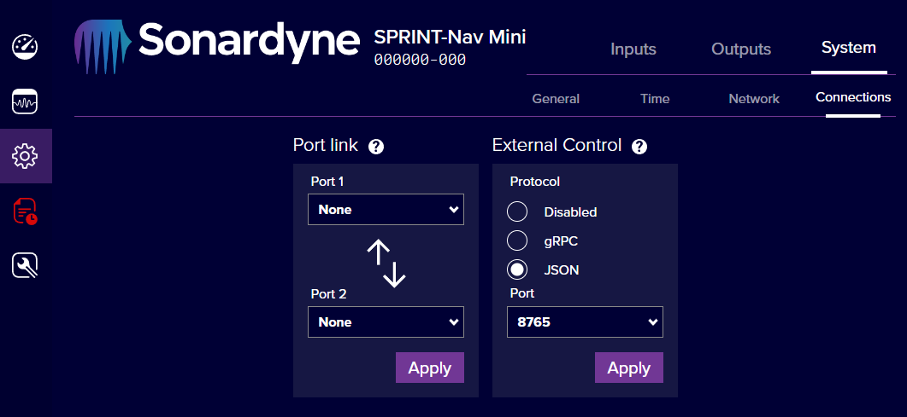

## Connecting to the API

### Configuring gRPC or JSON via Web UI

The 'External Control' page in the webUI (located under Configuration>System>Connections) allows selection of a gRPC or JSON interface. The JSON interface operates via any of the ports specified under the 'Network' tab, whereas the gRPC interface operates a TCP server on the port number specified in the webUI.

??? son-info "Network Ports"

    Please note there is currently no cross-validation between the gRPC server and the other Network ports, you must ensure that the gRPC port number is not already in use in the Network tab.

*Example screenshot from SPRINT-Nav Mini Web UI*


### Accessing .proto files

The .proto files which define the API will be needed before messages can be sent or received via gRPC. These files can be downloaded from the [Releases]({{ ex_repo_url }}/releases) page of the son-idl repo. They can also be found in the `idl` folder of this repo, alongside an explanation of all fields, provided by the `README.md` in the `idl` folder.


### Sending initial commands

The API implements three functions:

- GetVersion will return the API version number
- GetState will return the settings of the instrument
- SetState will update the instrument settings

### Development/Debugging Tools

See [external reference](external_reference.md).

## Development of a gRPC client
---
#### Python Example
These steps are largely based on the [grpc Python tutorial](https://grpc.io/docs/languages/python/basics/).

- Install gRPC and gRPC tools (protoc and code generation): `python -m pip install grpcio grpcio-tools`
- Download .proto files and put them in a `protos` directory in your python project.
- Generate python code from the .protos: `python -m grpc_tools.protoc --proto_path=./protos --python_out=. --grpc_python_out=.  ./protos/*.proto`

This will generate a few files - as a grpc client we are primarily interested in importing service_pb2_grpc, which will allow us to use GetState, SetState, and GetVersion.
??? son-info "Example python code"
    ``` py title="example_code/py/GrpcClient.py"
    --8<-- "{{ ex_example_code_path }}/py/GrpcClient.py"
    ```

---
#### C\# Example

The recommended implementation for gRPC with .NET is now [grpc-dotnet](https://github.com/grpc/grpc-dotnet). Microsoft provide a [tutorial](https://learn.microsoft.com/en-gb/aspnet/core/tutorials/grpc/grpc-start) on its use.

The .csproj file needs to be modified to include the proto files and proto directory,  and to specify the project as a gRPC client, e.g.  
`<Protobuf Include="service.proto" ProtoRoot="protos/" GrpcServices="Client"/>`  
Note that a wildcard `*` can be used e.g. `Include="*.proto"`, however this was found to cause problems with certain ProtoRoot directories and be less clear when debugging.
??? son-info "Example C# code"
    ``` csproj title="example_code/cs/SonGrpcClient.csproj"
    --8<-- "{{ ex_example_code_path }}/cs/SonGrpcClient.csproj"
    ```

    ``` c# title="example_code/cs/Program.cs"
    --8<-- "{{ ex_example_code_path }}/cs/Program.cs"
    ```

#### C++ Example

As C++ has no universally accepted standard for managing project dependencies, [gRPC supports several methods](https://github.com/grpc/grpc/tree/master/src/cpp#to-start-using-grpc-c).
The supplied C++ example code makes use of cmake, using `find_package`. This can only find software installed on your system, so gRPC will need to be [installed from source using cmake](https://github.com/grpc/grpc/blob/master/BUILDING.md). The installation location will then be referenced in cmake options to allow `find_package` to work.

The .proto files can be built automatically using a custom command in cmake, as per the example code below. Alternatively, the source/header files can be generated from the .proto files manually with the following command:

`protoc --cpp_out=./proto-cpp-out/ --grpc_out=./proto-cpp-out/ --proto_path=protos/ protos/*.proto`

- `--cpp_out` specifies where to put the generated proto source/header files
- `--grpc_out` specifies where to put the generated grpc source/header files
- `--proto_path` specifies where the .proto files are located (used when proto files reference each other)
- The final parameter specifies the .proto file(s) to be compiled.

protoc may require an extra parameter to specify the location of the gRPC C++ plugin, for example under Linux this could be:  
`--plugin=protoc-gen-grpc='which grpc_cpp_plugin' `

The example client code below made use of [this guide](https://grpc.io/docs/languages/cpp/basics/#client).
??? son-info "Example C++ code"
    ``` cmake title="example_code/cpp/CMakeLists.txt"
    --8<-- "{{ ex_example_code_path }}/cpp/CMakeLists.txt"
    ```

    ``` cmake title="example_code/cpp/src/CMakeLists.txt"
    --8<-- "{{ ex_example_code_path }}/cpp/src/CMakeLists.txt"
    ```

    ``` cpp title="example_code/cpp/src/main.cpp"
    --8<-- "{{ ex_example_code_path }}/cpp/src/main.cpp"
    ```
